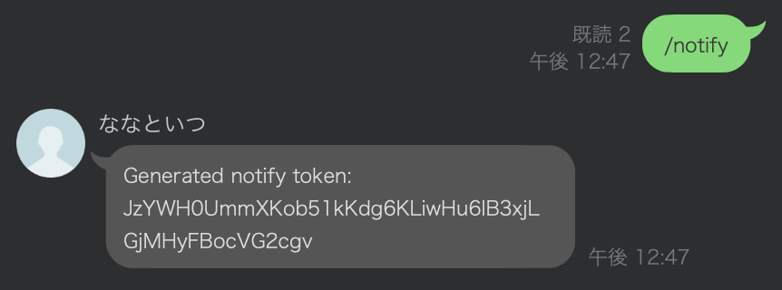

# Pseudo LINE Notify with LINE WORKS

LINE Notify がサービス終了したので、LINE WORKS を使用して擬似的に Notify を実現する。

## Usage

env initialize

```bash
$ python -m venv venv
$ . venv/bin/activate
(venv) $ make init
```

sample code: [simple_json.py](simple_json.py)

```bash
(venv) $ python simple_json.py
 * Serving Flask app 'simple_json'
 * Debug mode: off
WARNING: This is a development server. Do not use it in a production deployment. Use a production WSGI server instead.
 * Running on all addresses (0.0.0.0)
 * Running on http://127.0.0.1:3333
 * Running on http://192.168.11.56:3333
```



```bash
curl -X POST http://127.0.0.1:3333/notify \
  -H "Content-Type: application/json" \
  -d '{"token": "JzYWH0UmmXKob51kKdg6KLiwHu6lB3xjLGjMHyFBocVG2cgv", "message": "Pseudo notify message"}'
```


## GitHub Actions

The following linter results are detected by GitHub Actions.

- ruff
- mypy
